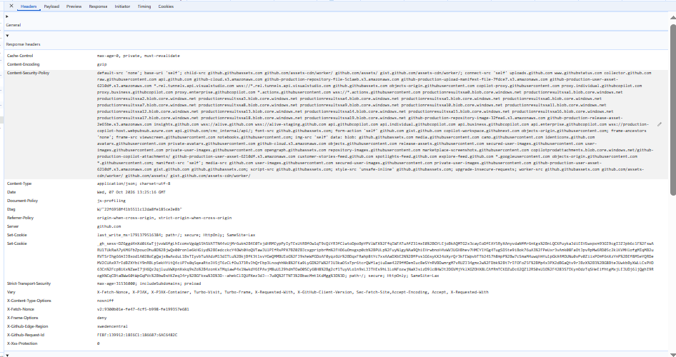
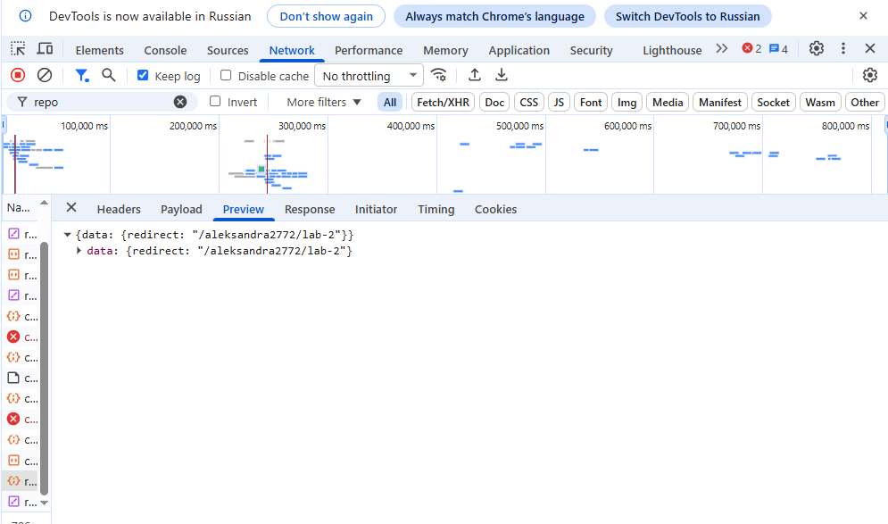

## Лабораторная работа №2

## Анализ веб-приложения и клиент-серверного взаимодействия

## 1. Исследуемая информационная система

Для выполнения лабораторной работы был выбран сервис GitHub и пользовательский сценарий: создание нового репозитория.

GitHub - платформа для создания программного обеспечения. Она позволяет разработчикам хранить проекты в репозиториях, отслеживать изменения в коде и работать над ним в команде.

В ходе исследования были выделены следующие основные компоненты:

- браузер пользователя
- интерфейс сайта 
- клиентский JavaScript, который управляет заполнением формы и валидацией
- API-сервис, принимающий запросы от клиента
- backend, реализующий бизнес-логику создания репозитория
- хранилище данных 
- внешние сервисы и ресурсы

### 1.1. Сценарий исследования

Исследуемый сценарий:

1. Авторизация в личным кабинете GitHub
2. Переход на страницу создания нового репозитория
3. Ввод имени репозитория и настроек видимости 
4. Нажатие кнопки создания репозитория
5. Отправка POST-запроса на сервер
6. Получение ответа от сервера и перенаправление на страницу созданного репозитория

## 2. Анализ HTTP-запросов

В работе для изучения сетевого взаимодействия использовалась вкладка Network в браузерных DevTools. Перед началом сценария список запросов был очищен, после чего были выполнены действия, связанные с созданием репозитория на GitHub. В результате удалось наблюдать сетевые обращения, которые обеспечивали загрузку интерфейса, получение данных страницы и передачу параметров нового репозитория на сервер.

### 2.1. Основные наблюдения

Во время исследования были замечены следующие типы HTTP-запросов:

- GET-запросы для загрузки HTML, CSS, JavaScript-модулей и статических ресурсов интерфейса GitHub;
- POST-запросы для отправки данных формы создания репозитория на сервер;
- запросы на получение/обновление состояния интерфейса и списков репозиториев;
- служебные запросы, связанные с сессией, авторизацией, телеметрией и аналитикой.

### 2.2. Таблица HTTP-запросов

Ниже приведены типичные запросы, обнаруженные в ходе исследования. Для безопасности и корректности отчета реальные значения cookies, токенов и идентификаторов не приводятся, а вместо них указаны типы и назначение данных.

| № | Метод | URL / тип запроса | Статус | Назначение |
|---|---|---|---|---|
| 1 | GET | /new | 200 OK | Загрузка формы создания репозитория |
| 2 | GET | .../module.css | 200 OK | Загрузка стилей интерфейса (stylesheet) |
| 3 | GET | .../index.js | 200 OK | Загрузка скриптов frontend-логики |
| 4 | POST | /repositories (или API создания) | 201 Created / 302 Found | Отправка данных формы и создание репозитория |
| 5 | GET | /{user}/{repo} | 200 OK | Перенаправление (редирект) и загрузка главной страницы созданного репозитория |
| 6 | POST | /_/s/analytics | 204 No Content | Служебный аналитический запрос |

### 2.3. Запросы, относящиеся к пользовательскому сценарию

К выбранному сценарию относятся те запросы, которые были запущены после заполнения полей и нажатия кнопки создания репозитория («Create repository»). В частности, после активации элемента интерфейса браузер инициировал POST-запрос с параметрами репозитория (имя, описание, настройки приватности), что подтверждает, что интерфейс работает не локально, а через активный сетевой обмен данными с бэкендом GitHub.

Наблюдаемый факт: после действия «Create repository» в DevTools фиксируется POST-запрос отправки формы, за которым следует код успешного ответа и переадресация на страницу нового репозитория.

Предположение: запрос обрабатывается API-сервисом и backend-модулем GitHub, который создает запись в базе данных метаданных, инициализирует структуру хранения Git и возвращает клиенту данные для редиректа.

## 3. Анализ HTTP-ответов

После выполнения запроса сервер возвращает HTTP-ответ, в котором содержатся статус-код, заголовки и тело ответа. Для анализа были выбраны два запроса: один на загрузку страницы создания репозитория и один на отправку формы (создание репозитория).

### 3.1. Пример анализа ответа на запрос страницы

Для запроса загрузки страницы создания репозитория был получен ответ со статусом 200 OK. Это указывает на успешную загрузку страницы, после чего браузер начал рендерить интерфейс.

Основные наблюдаемые заголовки:
- Content-Type: text/html; charset=utf-8;
- Cache-Control: политика кэширования содержимого (например, no-cache или private);
- Date: дата и время ответа;
- Server: название серверного программного обеспечения.

Тело ответа представляло HTML-страницу, необходимую для инициализации интерфейса создания репозитория.

### 3.2. Пример анализа ответа на запрос создания репозитория

Для API-запроса или POST-запроса формы, связанного с созданием репозитория, был получен ответ со статусом 201 Created (или 302 Found с редиректом), что соответствует успешной операции. Это означает, что сервер подтвердил выполнение действия и передал результат или выполнил переадресацию.

Пример структуры ответа (JSON):
{
"id": 123456789,
"name": "my-new-repo",
"full_name": "username/my-new-repo",
"private": false,
"html_url": "https://github.com/username/my-new-repo",
"owner": {
"login": "username"
}
}

В ответе были найдены данные о созданном репозитории, включая его уникальный идентификатор, имя, статус приватности и ссылки. Браузер получал эти данные или заголовок Location при редиректе и перенаправлял пользователя на страницу нового репозитория.

### 3.3. Наблюдаемые факты и предположения

- Наблюдаемый факт: сервер возвращает успешный статус (201 Created или 302 Found) и данные созданного репозитория после отправки формы.
- Предположение: backend выполняет валидацию данных, создает запись в базе данных метаданных, инициализирует структуру репозитория в хранилище Git и возвращает клиенту информацию для перенаправления.
- Предположение: часть логики обработки запроса вынесена в специализированный API-сервис GitHub, обеспечивающий работу веб-интерфейса.

## 4. Анализ параметров и передаваемых данных

При выполнении пользовательского сценария (создание нового репозитория на GitHub) браузер передавал серверу информацию, необходимую для инициализации нового проекта в системе контроля версий.

### 4.1. Параметры запроса

В запросах, связанных с созданием репозитория, можно выделить следующие типы параметров:

* В теле запроса (Payload / Form Data):
* имя репозитория (например, repository[name]);
* описание репозитория (repository[description]);
* тип видимости (repository[visibility] — public или private);
* параметры инициализации (например, добавление файла README, .gitignore или выбор лицензии).

* В заголовках:
* Content-Type (тип передаваемых данных, например, application/x-www-form-urlencoded или application/json);
* X-Requested-With (идентификатор асинхронных запросов);
* идентификатор сессии и авторизационные токены (внутри cookie и заголовках вроде authorization).

### 4.2. Где находятся данные

Параметры были расположены следующим образом:
* часть служебных данных и токенов — в cookie и заголовках запроса;
* основные данные формы (имя, описание, настройки) — в теле HTTP-запроса (payload / form data).

### 4.3. Какие данные передаются при создании репозитория

При отправке формы создания репозитория сервер получает:
- уникальное имя репозитория в рамках аккаунта;
- выбранные пользователем настройки доступа (публичный или приватный);
- флаги инициализации сопутствующих файлов (README, лицензия).

В ответе сервер обрабатывает переданные данные, создает запись в базе данных, инициализирует пустой Git-репозиторий на бэкенде и возвращает статус успешного создания (201 Created или 302 Found) с перенаправлением на страницу нового репозитория.

## 5. Анализ cookies

Cookies используются в веб-приложениях для хранения небольших данных, которые браузер должен отправлять серверу при последующих запросах. В GitHub это используется для авторизации, идентификации сессии, обеспечения безопасности и хранения пользовательских настроек интерфейса.

### 5.1. Что было обнаружено

Для исследуемого сайта были просмотрены cookies через вкладку Application / Storage в панели разработчика. Пример структуры cookie:

| Имя cookie | Домен | Срок действия | Назначение | Флаги / Комментарии |
| :--- | :--- | :--- | :--- | :--- |
| user_session | .github.com | Длительный срок | идентификация активной сессии авторизованного пользователя | Secure, HttpOnly, SameSite=Lax |
| logged_in | .github.com | Длительный срок | флаг факта авторизации в системе | Secure, SameSite=Lax |
| _gh_sess | .github.com | Сессия | сессионный идентификатор для хранения временных данных | Secure, HttpOnly, SameSite=Lax |
| color_mode | .github.com | Длительный срок | хранение пользовательских настроек темы интерфейса (светлая/темная) | Secure, SameSite=Lax |

### 5.2. Анализ результатов

- Наблюдаемый факт: на сайте используются cookies, которые отправляются вместе с запросами к домену сервиса.
- Предположение: часть cookies отвечает за безопасность, авторизацию и удержание сессии пользователя (user_session, _gh_sess), а часть — за персональные настройки интерфейса и предпочтения отображения.
- Предположение: использование флагов HttpOnly и Secure повышает безопасность приложения, защищая сессионные куки от перехвата через JavaScript и утечек по незащищенным соединениям.

## 6. Взаимодействие Frontend, API и Backend

Для выбранного пользовательского сценария (создание нового репозитория) важным является понимание цепочки событий от действия пользователя до визуального перенаправления и отображения интерфейса нового проекта.

### 6.1. Последовательность событий

* Пользователь заполняет форму создания репозитория (имя, видимость, настройки) 
* Интерфейс веб-приложения GitHub
* JavaScript / frontend-логика обрабатывает событие отправки формы
* HTTP-запрос (POST) отправляется к API или серверу обработки
* Backend-сервер принимает запрос, проверяет права и валидирует данные
* Сервер создает запись в базе данных и инициализирует структуру нового Git-репозитория
* Сервер возвращает ответ со статусом успеха (201 Created или 302 Found) и данными перенаправления
* Браузер обрабатывает ответ и перенаправляет пользователя на страницу созданного репозитория
* Пользователь видит интерфейс и рабочую область нового репозитория

### 6.2. Конкретное действие

Рассмотрим действие: пользователь нажимает кнопку «Create repository», отправляя форму с настройками проекта.

1. Пользователь взаимодействует с UI-элементом формы создания репозитория
2. Frontend реагирует на нажатие и формирует HTTP-запрос (POST /repositories или аналогичный эндпоинт) 
3. Браузер отправляет запрос на сервер GitHub
4. API-шлюз принимает запрос и передает его на backend-сервисы
5. Backend обрабатывает данные: проверяет уникальность имени репозитория, создает метаданные в БД и выделяет хранилище для репозитория
6. Сервер возвращает ответ об успешном создании и параметры перенаправления
7. Браузер осуществляет переход на страницу нового репозитория
8. Пользователь видит созданный репозиторий и стартовую страницу инструкции

### 6.3. Вывод по архитектуре

В результате исследования было подтверждено, что взаимодействие между клиентом и сервером происходит через протокол HTTP. Браузер не хранит состояние репозитория локально; он отправляет данные через запросы к API и серверу, что позволяет динамически управлять проектами и мгновенно получать результаты операций.

## 7. Сопоставление с архитектурой из лабораторной работы №1

По результатам первой лабораторной работы была построена предварительная архитектурная схема системы. Во второй лабораторной работе она была сопоставлена с реальным сетевым поведением GitHub при создании репозитория.

### 7.1. Что удалось подтвердить

Были подтверждены следующие элементы архитектуры:
* браузер пользователя является входной точкой взаимодействия с платформой;
* frontend загружает интерфейс формы создания репозитория, обрабатывает пользовательский ввод и формирует HTTP-запросы;
* API участвует в обмене данными между клиентской частью и серверами GitHub;
* backend отвечает за обработку запросов, валидацию данных и инициализацию Git-структуры;
* данные сохраняются в постоянном хранилище данных (базах данных и файловой системе хранилища репозиториев), а не только в памяти браузера;
* cookies используются для поддержания сессии авторизованного пользователя и обеспечения безопасности.

### 7.2. Что остается предположительным

Некоторые элементы архитектуры не были видны напрямую из DevTools, поэтому они остаются предположениями:
* внутренняя структура распределенных баз данных GitHub;
* особенности реализации микросервисной архитектуры на бэкенде;
* детали работы внутренних систем балансировки нагрузки и маршрутизации запросов;
* точная схема кеширования статического контента и CDN.

### 7.3. Дополнение архитектурной схемы

После исследования стало понятно, что взаимодействие при создании репозитория идет по следующей схеме:
* Пользователь
* Браузер
* Frontend (интерфейс GitHub и клиентский JS)
* API (шлюз запросов)
* Backend (бизнес-логика создания репозитория)
* Хранилище данных (БД метаданных и Git-хранилище)

и при необходимости задействуются внешние сервисы авторизации и аналитики.

## 8. Схема взаимодействия компонентов

На основании проведенного анализа была построена отдельная схема взаимодействия компонентов для сценария создания репозитория.

На схеме отражены:
* пользователь;
* браузер;
* frontend;
* API;
* backend;
* хранилище данных;
* направления обмена данными;
* HTTP-запросы и HTTP-ответы;
* JSON-передача данных;
* обновление интерфейса после ответа сервера.

## 9. Вывод

В ходе лабораторной работы было проведено исследование HTTP-взаимодействия в веб-приложении GitHub на выбранном сценарии «создание репозитория». Было установлено, что интерфейс работает через клиентский JavaScript, который отправляет HTTP-запросы к серверу, а сервер отвечает данными и статусами выполнения операции.

Были выявлены следующие важные результаты:
* браузер и frontend тесно взаимодействуют для обработки пользовательского действия;
* запросы к API выполняются при загрузке страницы и при отправке формы создания репозитория;
* создание репозитория сопровождается HTTP POST-запросом и ответом сервера;
* данные передаются в URL и в теле запроса, а также хранятся в cookies;
* обратно пользователю приходит результат, который обновляет интерфейс без полной перезагрузки страницы.

Главный вывод состоит в том, что современное веб-приложение является распределенной системой: пользователь взаимодействует с UI, frontend формирует сеть запросов, API организует обмен данными, а backend обрабатывает их и сохраняет состояние. Важным является также разделение фактов и предположений: факты подтверждены в DevTools, а предположения обозначены как гипотезы, поскольку без доступа к серверной части нельзя установить внутреннюю реализацию с абсолютной уверенностью.

### 9.1. Результаты работы

* Подтверждено: наличие HTTP-запросов при создании репозитория.
* Подтверждено: наличие API-взаимодействия между frontend и backend.
* Подтверждено: использование cookies и заголовков HTTP для поддержания сессии и передачи данных.
* Подтверждено: обновление интерфейса после получения ответа сервера.
* Предположительно: конкретная реализация backend и структура внутренних сервисов.

В результате лабораторная работа была оформлена в виде отчета с описанием сетевого взаимодействия, таблицами запросов, анализом параметров и cookies, а также архитектурной схемой сценария.

